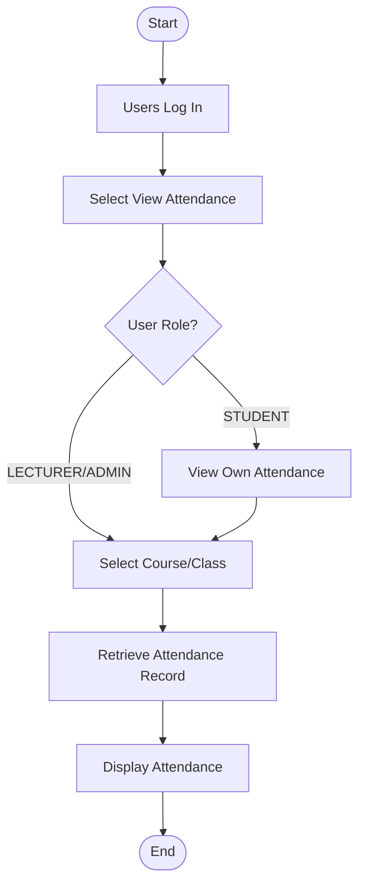

```mermaid
flowchart TD
  Start([Start]) --> A[Users Log In]
  A --> B[Select View Attendance]
  B --> C{User Role?}

  C -- STUDENT --> D[View Own Attendance]
  C -- LECTURER/ADMIN --> E[Select Course/Class]

  D --> E
  E --> F[Retrieve Attendance Record]
  F --> G[Display Attendance]
  G --> End([End])
```
