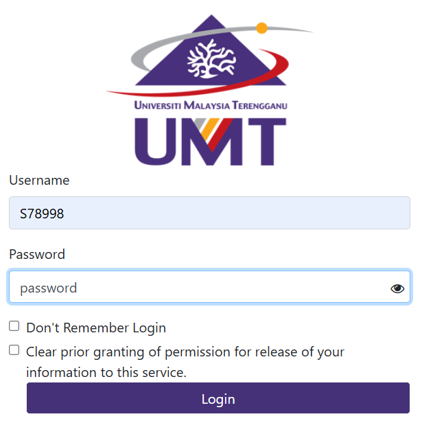
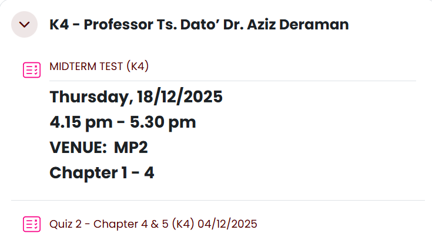
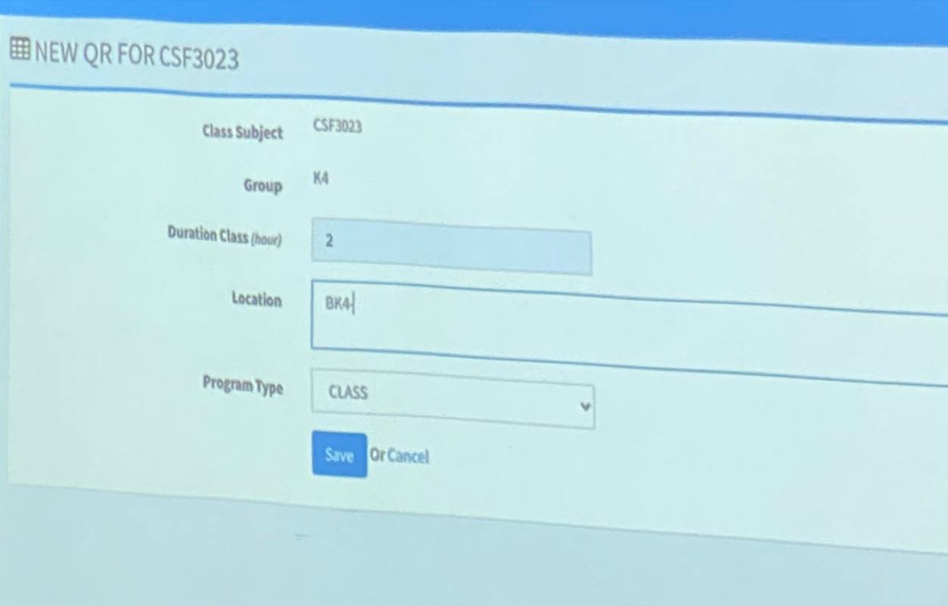
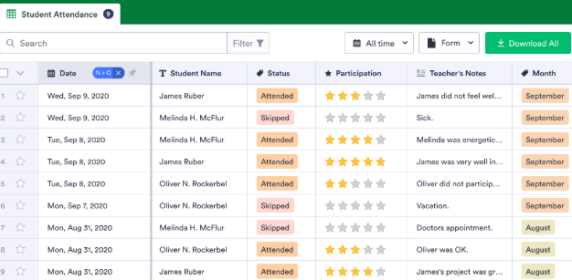
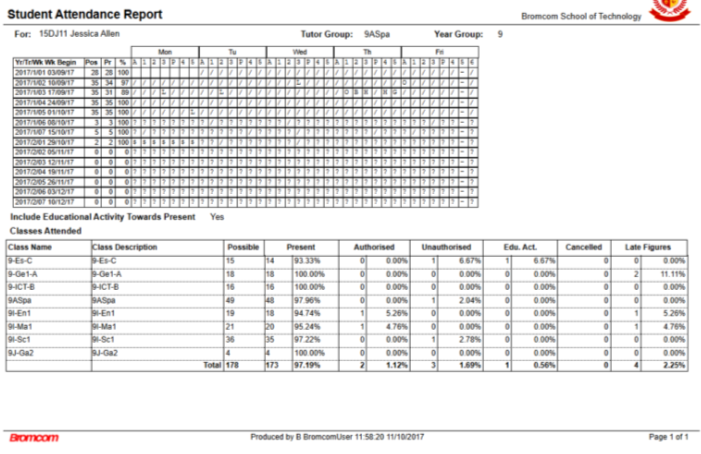

PROJECT NAME : ONLINE UNIVERSITY ATTENDANCE SYSTEM

CONTRIBUTORS : 

| TEAM MEMBER | MATRICS | ROLES |
|-------------|-------|----------------|
| MARSYA NATASHA BINTI MOHD ZAID | S78998 | Github Coordinator & Documentation and Final Report Compilation |
| MUHAMMAD SYAHIR AFIQ BIN ROSLI | S79056 | Introduction & Purpose of the System |
| MUHAMMAD ALIF NAUFAL BIN CHE MOKHTAR | S78921 | Designing flowcharts |
| MUHAMMAD AMIN BIN MOHD REDUAN | S79087 | Writing pseudocodes |

PROJECT DESCRIPTION : 

A web-based digital platform intended to monitor, schedule, and record how frequently students attend classes in a full-fledged university which allow lecturers and administrators to check student's attendance history, enter attendance digitally, and manage the courses, classes, and user accounts.

This project is about resolving the problems that traditional attendance-tracking methods, such as paper and digital sheets are very tiring, error-prone, and difficult to maintain with. The platform provides advanced educational supervision and data presentation while improving correctness, productivity, and transparency with the automated attendance tracking.

It is designed for operation among university students, administrators and lecturers. The administrators used to oversee scholastic frameworks and generate institution reports, while the lecturers are using these systems to record and evaluate the attendance data. Meanwhile, students use this system to update their attendance everyday.

MAIN FEATURES : 
- User Authentication and Role Management
- Course and Class Management
- Attendance Recording
- Attendance Viewing and Tracking
- Attendance Reporting

METHODS USED : 
- Flowcharts
- Pseudocodes

INTERFACE : 

Figure 1 : Login page to access the system.

Figure 2 : Example of course and class management.

Figure 3 : Example of attendance recording through QR.

Figure 4 : Example of attendance tracking in the system.

Figure 5: Example of attendance report in PDF file.
